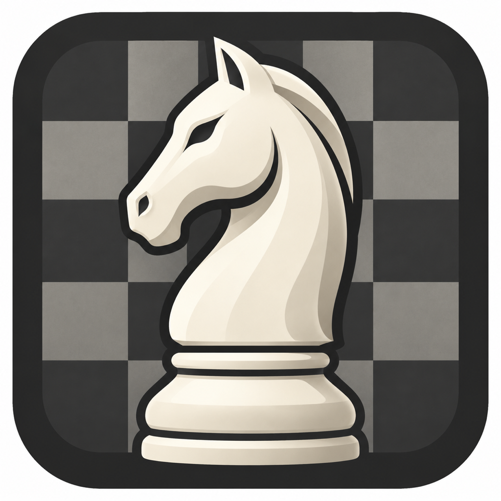
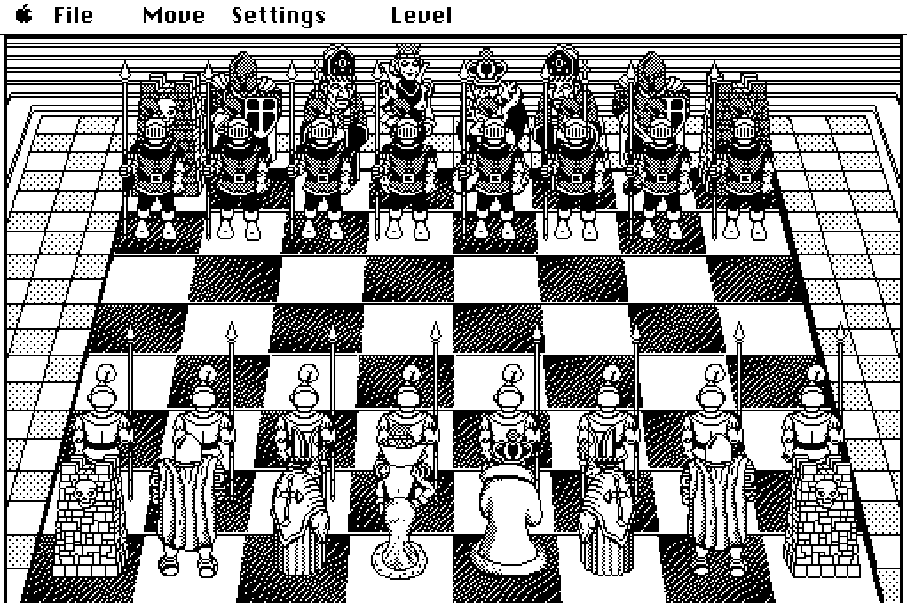
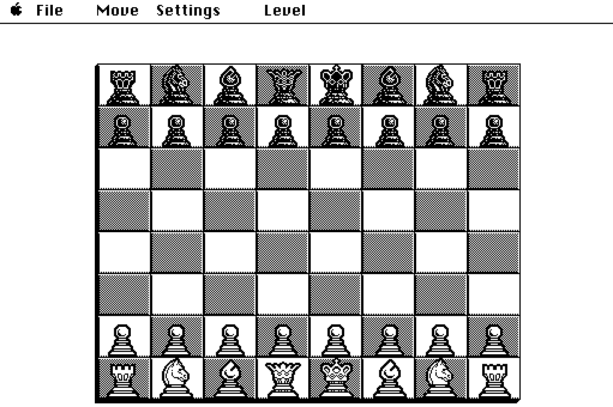
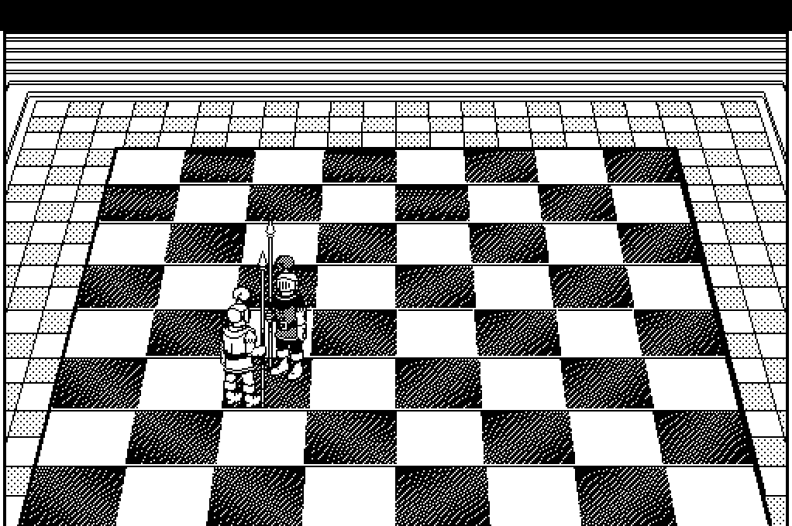

<p align="center"></p>

# BattleChess

Unofficial C/C++ recompilation of Battle Chess for Macintosh (1991), originally written for Motorola 68k processors. Runs natively on modern macOS and Linux/Unix using SDL3. Original game data must be supplied separately.

The C11 core translates recovered Macintosh move rules, opening-book traversal, evaluation, search, save format, and animation logic. The C++17 host replaces the Macintosh Toolbox with SDL3 and native file dialogs. This is a reverse-engineering project, not a clean-room implementation or an official release.

Implemented features include human/computer play, perspective and flat boards, movement and combat animations, promotion, board setup, save/load, move suggestions, and POSIX serial play. Full original-game parity remains incomplete: automatic idle triggers, original save/modem interoperability, and complete animation, audio, and computer-play comparisons still need verification.

## Screenshots

Captured from the native SDL application using an external game-data pack. These are application captures, not mockups; they depict original game artwork, which is outside the MIT license.

| Perspective board | Flat board |
|---|---|
|  |  |



## Documentation

- [Build on macOS and Linux](docs/BUILD.md): dependencies, core/app builds, release builds and troubleshooting.
- [Code style](docs/CODE_STYLE.md): naming, filenames, namespace indentation and formatting commands.
- [Roadmap and feature coverage](docs/ROADMAP.md): implemented features, validation results and remaining recovery work.
- [External game data](docs/DATA.md): required pack files and the boundary between source and original resources.

## Build the core

Requires a C11/C++17 compiler and CMake 3.20+. No original files, SDL, or Python are needed for the default build.

```sh
./tools/build.sh
```

The script selects a core-only Debug build, compiles it, and runs the core tests, even after an earlier app build. To enable AddressSanitizer and UndefinedBehaviorSanitizer:

```sh
./tools/build.sh -DBC_SANITIZE=ON
```

## Build and run the game

The application additionally requires SDL3 3.4+ development files and an external prepared data pack. Original binaries, disk images, graphics, audio, fonts, and generated resource tables are excluded from this repository. Data preparation belongs to the separate reverse-engineering toolchain; see [the data contract](docs/DATA.md).

See [macOS and Linux build instructions](docs/BUILD.md) for dependency installation, custom SDL paths, release builds, and troubleshooting. These scripts do not download dependencies or game data.

```sh
export BC_DATA_DIR=/absolute/path/to/prepared-data
./tools/build.sh -DBC_BUILD_APP=ON -DBC_DATA_DIR="$BC_DATA_DIR"
./tools/run.sh
```

Both scripts work from any directory. `run.sh` configures and builds the app before launching it, so changing the data pack also rebuilds its compiled catalogs. All tests in this repository are C/C++; Python is not required.

Direct CMake use:

```sh
cmake -S . -B build -DBC_BUILD_APP=ON -DBC_DATA_DIR="$BC_DATA_DIR"
cmake --build build --parallel
ctest --test-dir build --output-on-failure
./build/battlechess --data "$BC_DATA_DIR"
```

Add `-DCMAKE_PREFIX_PATH=/path/to/sdl3` when SDL is installed outside CMake's search path. Direct CMake commands retain cached options; `tools/build.sh` selects the core by default, and an explicit `-DBC_BUILD_APP=ON` enables the application.

## Controls

Click a piece, then its destination. The menus provide new game, open/save, take back, replay, board setup, move suggestions, and player/view settings. Human White and Mac Black are the initial modes. Promotion presents the recovered piece choices after the pawn moves.

Command/Ctrl+N, O, S, B, R, and Q access the corresponding menu actions. Command/Ctrl+F forces a computer move; Command/Ctrl+M suggests a move. Escape dismisses a menu or selection. `--flat` starts with the flat board, and `--serial DEVICE` connects a POSIX serial device. `--help` lists application options.

Settings → Animation Speed opens a submenu with 1x (original timing), 1.25x, 1.5x, 1.75x, and 2x for movement, combat, and capture fades. Hover or click Animation Speed, then release over a speed to select it. The selected speed lasts for the current application session and is independent of the computer's thinking time.

## Layout

```text
config/    Build and formatting configuration
lib/       C engine and C++ presentation code
src/       SDL application and native platform adapters
resources/ App icon and native-game screenshots
tests/     C/C++ core and integration checks
tools/     Build and run scripts only
docs/      Build instructions, code style, roadmap and external data requirements
```

Functions retain original addresses and recovery explanations where known. Native adapters are identified separately. Decompiler exports, Ghidra projects, recovery scripts, and evidence captures belong to the reverse-engineering workspace.

A successful build or native test does not establish equivalence to the original Macintosh executable.

## License

Project contributions use the [MIT license](LICENSE). The project is unofficial and is not affiliated with or endorsed by the original rights holders. Original game and third-party material are outside that license; see [NOTICE](NOTICE).
